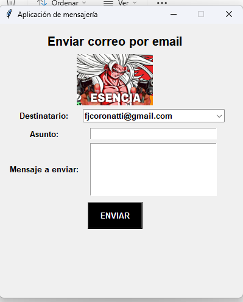

TPL2(Enviar email)

El proyecto consiste en forkear otro repositorio con las carpetas y los códigos y elegir cuaiquiera y modificarla, agregándole un combobox, creando un menú de opciones con varios mails recomendados, pero también te permite escribir el mail al cual enviarle el mensaje, un icono diferente, loguear un mail diferente con otra contraseña y ajustar la interfaz gráfica a nuestro gusto.

Proceso de modificación

Primero cambiamos los colores de la interfaz a nuestro gusto y cambiamos obligatoriamente la imagen que viene por default por una personalizada

Luego importamos la función ttk desde tkinter, luego, debajo del código del Label del destinatario, agregamos el combobox utilizando la función ttk, especificamos donde lo vamos a mostrar(ventana), la variable de texto, la fuente, el tamaño del Label y luego los mails recomendados en el menú de opciones y lo colocamos en la fila 3 y columna 1

Imagen del icono

Captura del programa

